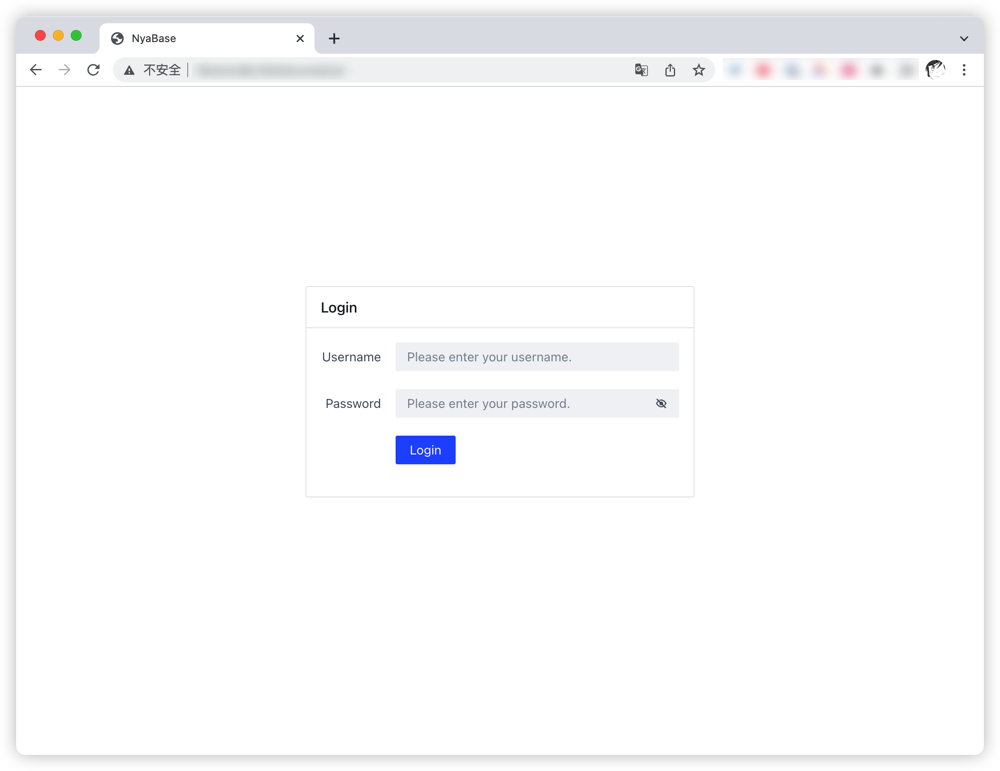
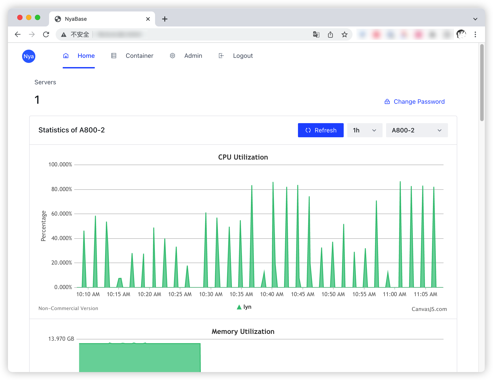
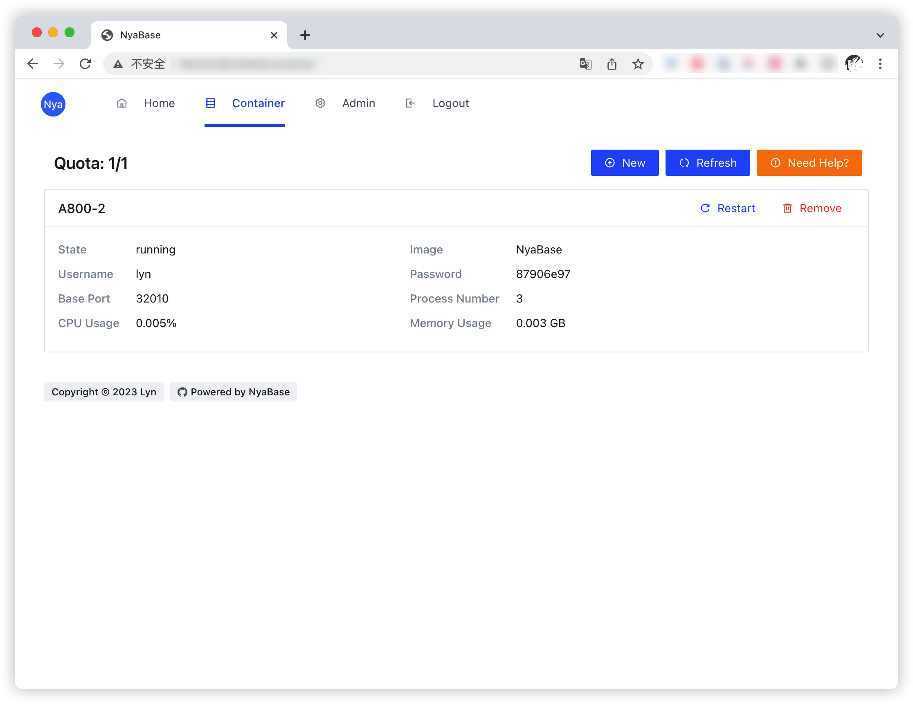

# 用户使用手册

## 项目简介

本系统是一个基于 Node.js 开发的实验室容器管理系统，用于实验室环境下容器的创建、监控、销毁等功能。本系统支持多用户，每个用户可以在系统管理自己的容器，并查看容器的资源使用情况。

## 使用说明

### 登录

用户可以通过用户名和密码登录系统，如果没有账号，请联系实验室管理员。



### 首页

登录成功后，用户可以在首页查看系统的所有服务器的 CPU、内存、网络、GPU等资源使用情况。



在右上角，用户可以点击更改密码，强烈建议所有用户修改默认密码。

### 容器管理

在容器管理页面，用户可以查看自己的容器，包括容器的名称、运行状态、CPU、内存等资源使用情况，以及IP、登录密码以及SSH端口。

> **注意：目前容器仅对外开放SSH端口，以及SSH端口的后九个端口。**比如，如果容器的SSH端口为21010，则容器对外开放的端口为21010-21019。



用户可以选择销毁容器，销毁容器后，容器中除了`/home`外的数据将会被删除，且无法恢复。目前，每个用户在每个服务器仅允许创建一个容器，如果需要创建多个容器，请联系实验室管理员。

镜像选择方面，目前仅提供`NyaBase`配套容器镜像，该镜像预装Mamba及Python3.10环境。如果需要其他镜像，请联系实验室管理员。

## FAQ

### 如何使用SSH登录容器？

在容器管理页面，即可查看容器的IP、SSH端口以及登录密码，可使用如下命令登录容器：

```bash
ssh -p <SSH端口> <用户名>@<IP>
# 例 ssh -p 21010 lyn@202.0.0.1
```

### 开放的端口不够用怎么办？

目前，每个容器仅对外开放SSH端口，以及SSH端口的后九个端口。如果需要更多端口，可以使用SSH隧道将端口转发至本地。

```bash
ssh -p <SSH端口> -L <本地端口>:127.0.0.1:<容器端口> <用户名>@<IP>
# 例：下面的命令会将容器的80端口转发至本地的8080端口
ssh -p 21010 -L 8080:127.0.0.1:80 lyn@202.0.0.1
```

### 有Bug？

请将浏览器开发者工具箱(F12)的Console截图发给实验室管理员处理。

## LICENSE

Copyright (c) 2023 [Lyn](mailto:i@lyn.moe)
