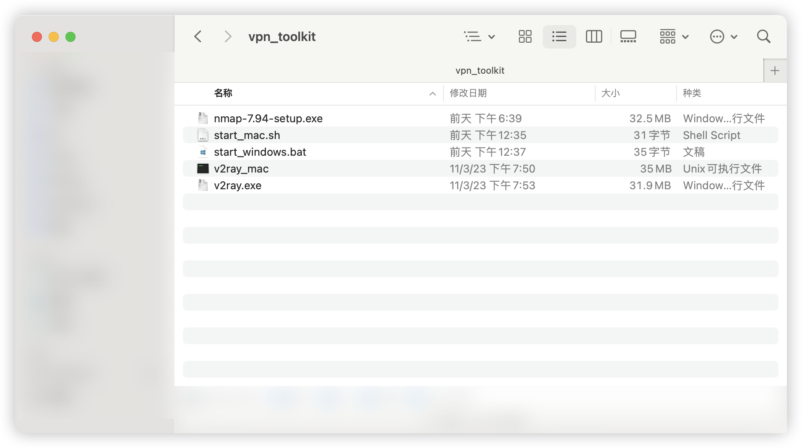
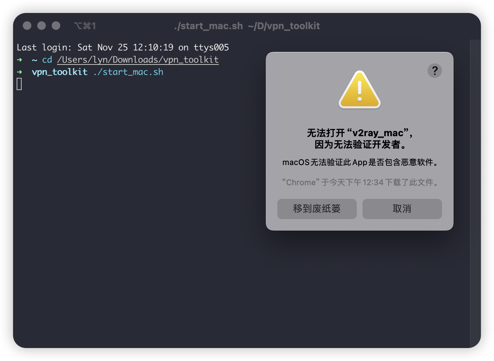
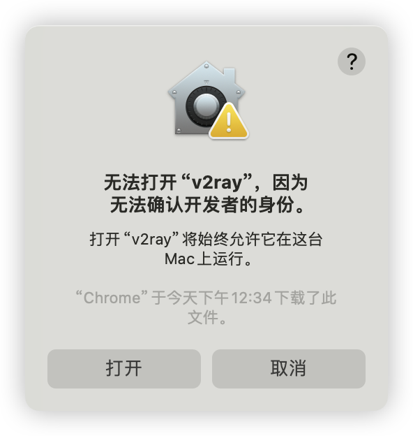
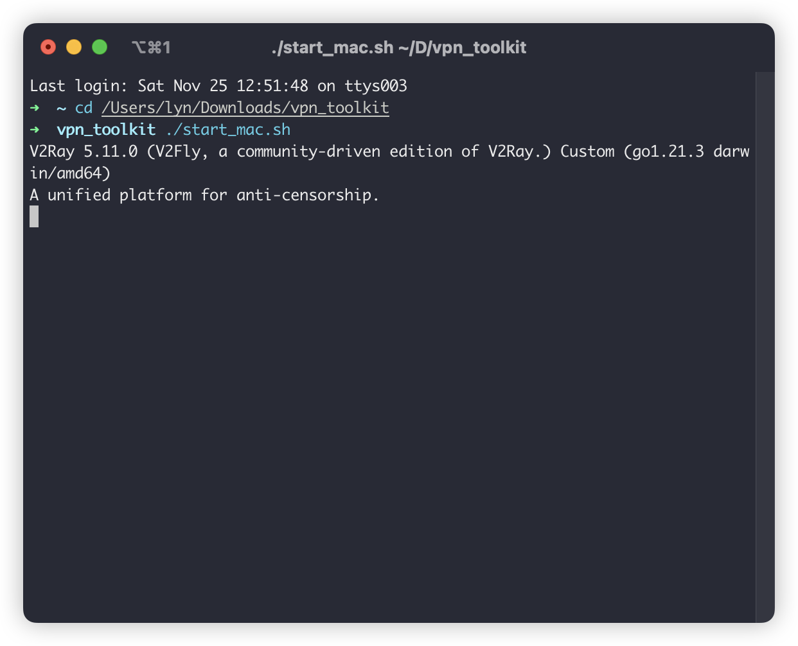
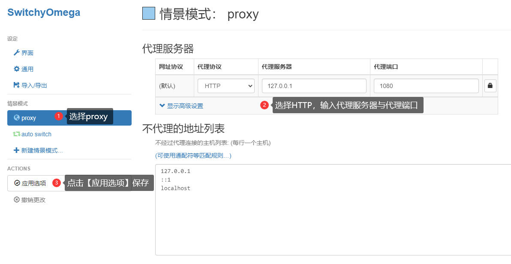
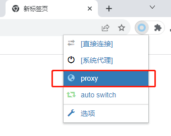

# VPN 连接手册

## 手册说明

本手册用于介绍在校外通过 VPN 连接实验室服务器的方法

> 若您对 V2Ray 有所了解, 请直接参考 `config.json` 中的配置, 并使用 V2Ray 客户端通过 TUN 模式连接

## 使用说明

### 主程序设置

解压 `vpn_toolkit.zip`, 会得到下图所示的目录



请将随程序附带的 `config.json` 放置在 `vpn_toolkit` 目录下, 请勿修改 `config.json` 的内容

### 启动 VPN 服务

#### Windows

双击 `start_windows.bat` 即可启动 VPN 服务

#### MacOS

打开 `Terminal` 应用, 输入 `cd ` (注意后面有一个空格), 将 `vpn_toolkit` 目录拖入 `Terminal` 窗口, 回车, 输入 `./start_macos.sh` 即可启动 VPN 服务



如果遇到上图所示的提示, 请点击 `取消`, 然后返回到 `Finder` 窗口, 找到 `vpn_toolkit` 目录, 按住键盘 `Option` 键并左键单击 `v2ray_mac` 文件, 选择 `打开`, 然后再次点击 `打开`, 关闭弹出的 `Terminal` 窗口, 重复第一步即可启动 VPN 服务, 如下图所示



### 连接 VPN

VPN 服务启动后, 正常启动后, 应该会出现如下图所示的提示, 请勿关闭此窗口, 否则 VPN 服务将会停止



此时 VPN 服务已经正常启动, 并在本地的 `10888` 端口监听一个 `socks5` 代理

#### 访问容器管理平台

首先需要安装一个 `socks5` 代理客户端, 本手册推荐使用 `Proxy SwitchyOmega`, 请前往[官网](https://proxy-switchyomega.com/download/)下载并安装

安装完成后, 依照下列图示配置, 下图2的位置需要选择 `socks5`, 地址为 `127.0.0.1`, 端口为 `10888`



此时新建标签页, 访问[容器管理平台](http://10.0.4.12:3000)(http://10.0.4.12:3000), 并依照下图选择对应代理, 即可正常访问



访问结束后, 请关闭 `Proxy SwitchyOmega` 的代理, 否则可能会导致无法正常访问互联网

对于容器管理平台的疑问, 请参考《用户使用手册》

#### 连接 SSH

> 注意: 容器管理平台中的地址为校园网地址, 需要依照下列映射切换为内网地址, 端口保持不变

| 服务器名 | 内网地址 |
| :---: | :---: |
| A800-1 | 10.0.4.11 |
| A800-2 | 10.0.4.12 |
| A800-3 | 10.0.4.14 |
| L40-1 | 10.0.4.15 |
| A800-4 | 10.0.4.16 |
| H100-1 | 10.0.4.17 |

+ 通过命令行
  
  ```bash
  ssh -o ProxyCommand='nc -X 5 -x 127.0.0.1:10888 %h %p' <用户名>@<服务器地址> -p <端口>
  ```

+ 通过 VSCode (Windows)

  编辑 `%USERPROFILE%\.ssh\config` 文件, 添加如下内容

  ```bash
  Host <服务器名>
      HostName <服务器地址>
      User <用户名>
      Port <端口>
      ProxyCommand connect -H 127.0.0.1:10888 %h %p
      ForwardAgent yes

+ 通过 VSCode (MacOS)

  编辑 `~/.ssh/config` 文件, 添加如下内容

  ```bash
  Host <服务器名>
      HostName <服务器地址>
      User <用户名>
      Port <端口>
      ProxyCommand nc -X 5 -x 127.0.0.1:10888 %h %p
  ```

+ 其他 SSH 客户端

  请参考客户端的文档, 配置 `socks5` 代理

## FAQ

### 无法启动 VPN 服务

请将 `vpn_toolkit` 目录下的 `v2ray.log` 文件及相关错误截图发给实验室管理员处理

## LICENSE

Copyright (c) 2023 [Lyn](mailto:i@lyn.moe)
